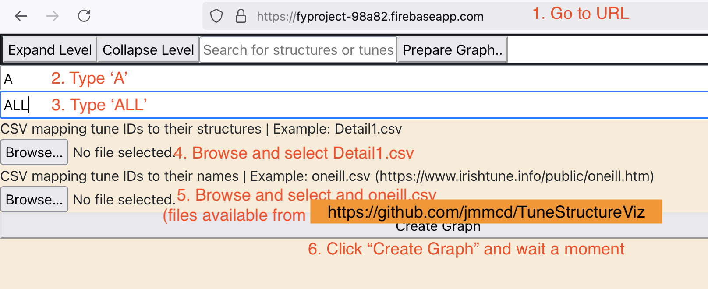

# TuneStructureViz

This repo contains the source code for the final-year project of Kieran Jayes, University of Galway BSc Computer Science and Information Technology, Academic Year 2022-2023. All code is copyright Kieran Jayes 2023.

The original repo is https://github.com/kieranjazy/TuneStructureViz.

I've added context and links in this README, and necessary data in `data/`.

# Introduction

The background to this project is a paper by Seán Doherty (DCU), "Melodic structures in the double jigs of O’Neill’s *The Dance Music of Ireland: 1001 Gems (1907)*. Journal of the Society for Musicology in Ireland, pages 19–45, 2022. Doherty manually annotated bar-level structures in the 1001 Gems, giving the file `data/Detail1.csv` which is copyright Seán Doherty 2022. An 8-bar tune's structure can be expressed as a word such as `a b a c a b a c1`. 

# Prefix Trees

Taken together, the collection of tune structures naturally forms a prefix tree. See the paper below for more discussion.

Jayes' project was to create a GUI to visualise and interact with this tree, for exploration of common patterns.

# Implementation

The application was implemented and hosted using Firebase, Node, Typescript, React, and D3.

# Demo

The application looks like this, after clicking "Prepare Graph":

As shown, the user should:

1. Visit [this url](https://fyproject-98a82.firebaseapp.com/) and click "Prepare Graph".
2. Type "A" in the first box. "A" refers to the A part of each tune. 
3. Type "ALL" in the second box. "ALL" means we take all types of tunes, ie reels, jigs, etc.
4. Browse and select the file `data/Detail1.csv` which is copyright Seán Doherty 2022.
5. Browse and select the file `data/oneill.csv` which is sourced from https://www.irishtune.info/public/oneill.htm and is copyright Francis O'Neill and David Moulton.
6. Then click "Create Graph" and wait a moment. 

When the graph appears, interact by clicking and by searching.
    

# Reuse

If you want to use the GUI for a different dataset, see the two csv files for the necessary format.

# Paper

"A prefix tree-based user interface for exploring abstract structure in Irish folk tune"

The paper <a href="https://www.titanmusic.com/events/hcii2023/workshop/accepted-papers/abstracts/5267-1.pdf">pdf is available </a>.

Kieran Jayes, Seán Doherty, James McDermott

The paper was presented at the "Workshop on Interactive Technologies for Analysing and Visualizing Musical Structure", at the HCI International 2023 Conference, Sunday 23 July 2023. 